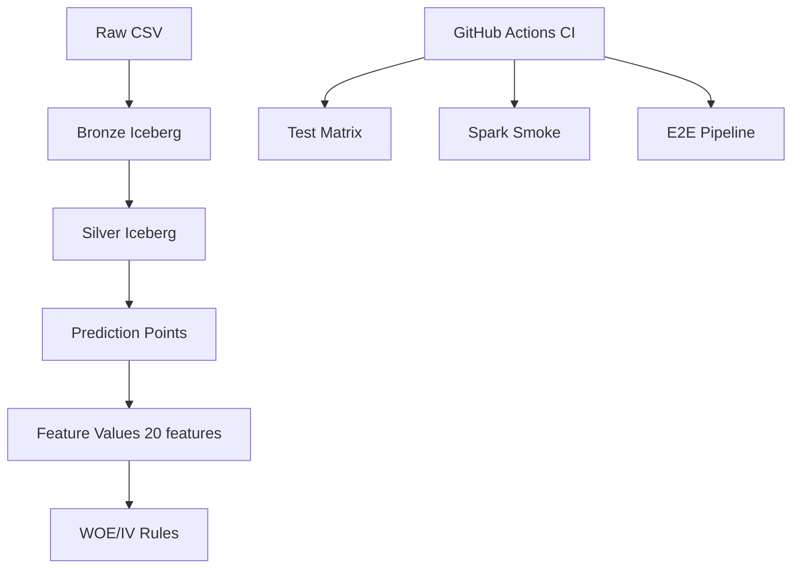

# RiskCloud

**基于 PySpark 与 Apache Iceberg 的信贷风控特征工程平台**

## 项目背景

在信贷风控中，数据泄漏（Data Leakage）是模型失效的首要原因。本项目演示如何通过严格的分层数据管道、预测时点（Prediction Point）约束和确定性的特征加工流程，从源头防止未来信息穿越到训练样本中。

## 解决的问题

1. **多源多表聚合**：申请信息、征信记录、月度状态等来自不同表，需要正确的 join 策略
2. **预测时点约束**：训练和在线特征必须证明在预测时点可获得
3. **训练服务一致性**：离线训练和在线推理共享同一份特征定义
4. **WOE/IV 规则拟合**：只在训练集上拟合规则，防止验证/OOT 信息泄漏

## 数据流架构



## 技术栈

| 组件 | 版本 |
|---|---|
| Python | 3.10+ |
| PySpark | 3.5.3 |
| Apache Iceberg | 1.6.1 |
| GitHub Actions | CI/CD |
| PyYAML | Config |

## 分层设计

```
Raw CSV (STRING)           ← 原始 Kaggle 数据
    ↓
Bronze Iceberg (STRING)    ← 不可变原始快照
    ↓
Silver Iceberg (CAST)      ← 类型标准化 + bureau_balance enrichment
    ↓
Prediction Points          ← 确定性 train/val/oot split
    ↓
Feature Values (20)        ← 8 app + 8 bureau + 4 bureau_balance
    ↓
WOE/IV Rules               ← Train-only fitting + 0.5 smoothing
```

## Prediction Boundary

使用固定合成锚点 `2000-01-01T00:00:00Z` 和确定性 hash split：
- Train: 80%
- Validation: 10%
- OOT: 10%

## 20 Features

| Group | Count | Examples |
|---|---|---|
| Application | 8 | credit/income ratio, age, ext scores |
| Bureau | 8 | record count, credit sum, days mean |
| Bureau Balance | 4 | month count, delinquency, latest status |

## WOE/IV Method

- 四分位确定性分箱
- 0.5 additive smoothing
- Missing bin 单独处理
- Training sample closure assertion

## 本地运行

```bash
# Install
pip install pyspark==3.5.3 pyyaml pytest

# Run tests
python -m pytest tests/ -v -m "not bronze_integration and not silver_integration and not e2e"

# Run with Java 17 for Spark/Iceberg integration tests
python -m pytest tests/ -v
```

## Docker 运行

```bash
docker compose build
docker compose run --rm riskcloud-demo
```

## 示例输出

```
Prediction Points: 30
Feature Values: 600
Feature closure: 20/20
WOE rule count: > 0
```

## CI

GitHub Actions: Python 3.10-3.13, Ruff, Freeze, Spark smoke, Bronze/Silver/E2E

## Known Limitations

- 本地 Spark 单机模式
- WOE/IV 在小规模 fixture 上使用 Driver 计算
- 未接入真实生产调度与监控
- 完整故障注入与跨 Manifest 治理仍在 Backlog

## Backlog

- P2: 分布式 Spark 重写
- P3: 完整治理加固
- P4: LR/CatBoost baseline 建模
- P5: 云平台部署
